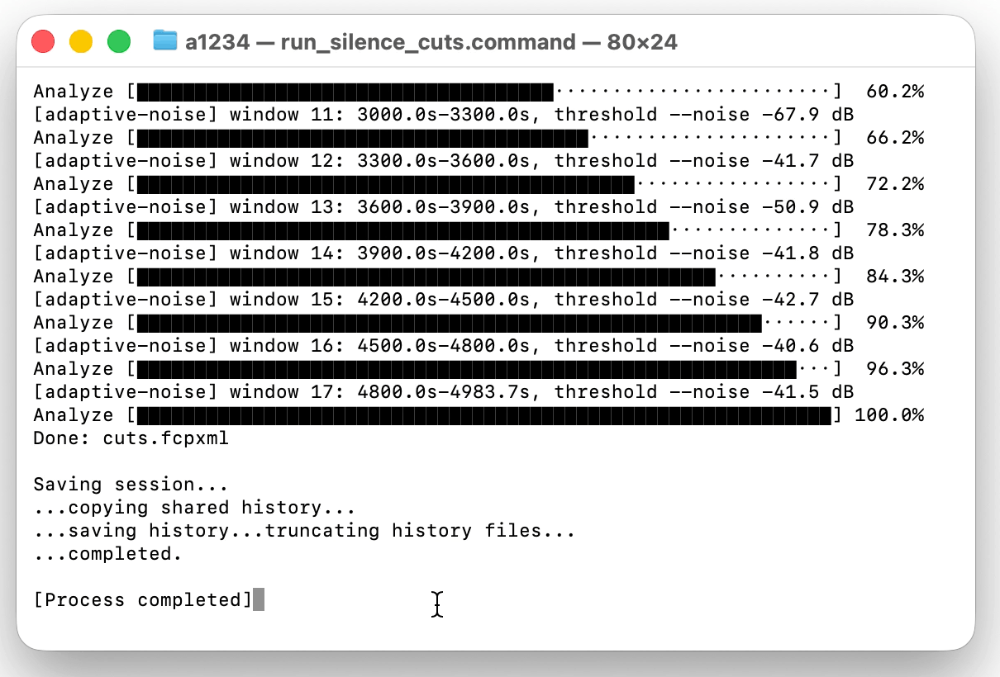
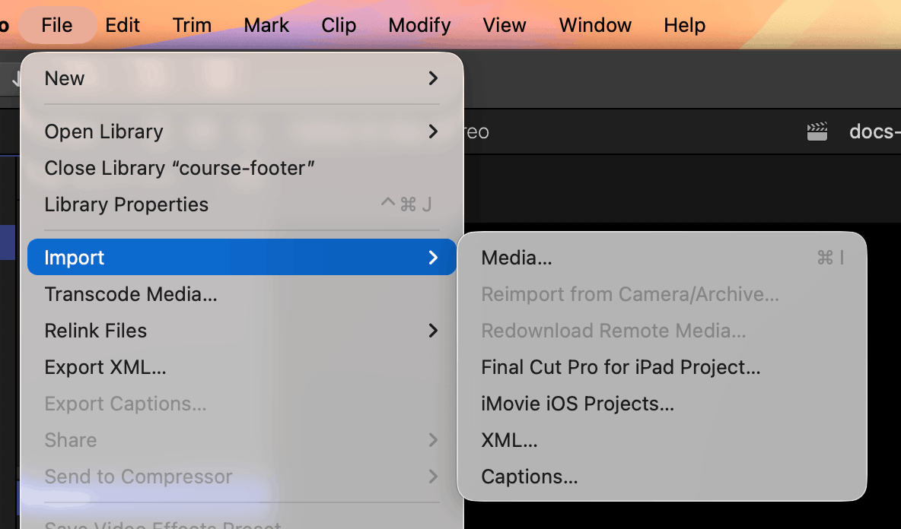
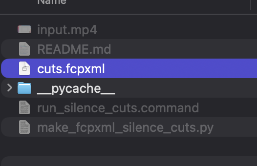
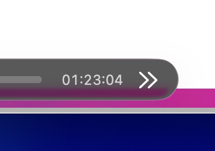
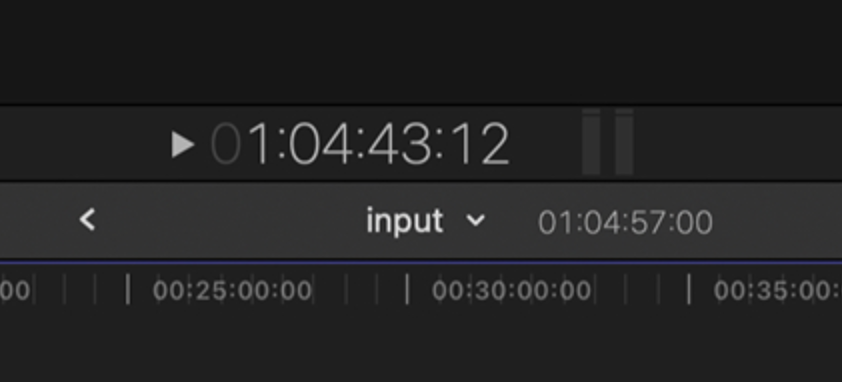

# FinalCutXML Silence Cuts

Generate a Final Cut Pro XML timeline that removes silent sections from a video.

The script uses FFmpeg's `silencedetect` filter to find pauses, converts the remaining speech regions into frame-aligned FCPXML clips, and writes a timeline that can be imported into Final Cut Pro.

## Features

- Detects silence with FFmpeg.
- Supports automatic noise threshold estimation.
- Supports adaptive per-window noise thresholds for recordings where background noise changes over time.
- Quantizes all clip boundaries to timeline frames.
- Adds configurable padding before and after speech regions.
- Shrinks detected silence before inversion to protect word edges.
- Generates Final Cut-friendly FCPXML format resources such as `FFVideoFormat1080p30`.

## Requirements

- Python 3.9 or newer
- FFmpeg with `ffmpeg` and `ffprobe` available in `PATH`
- Final Cut Pro for importing the generated `.fcpxml`

On macOS, FFmpeg can be installed with Homebrew:

```bash
brew install ffmpeg
```

## Usage

```bash
python3 make_fcpxml_silence_cuts.py input.mp4 -o cuts.fcpxml \
  --adaptive-noise \
  --min-silence 0.5 \
  --pad-pre 0.06 \
  --pad-post 0.16
```

Then import `cuts.fcpxml` into Final Cut Pro.

## What You See After Running

During processing, the script prints adaptive-noise windows, the local silence threshold for each window, and an overall progress bar. When processing finishes, it writes `cuts.fcpxml`.



## Import Into Final Cut Pro

In Final Cut Pro, choose `File -> Import -> XML...`.



Select the generated `cuts.fcpxml` file.



Final Cut Pro creates a new event and a cut project with the detected pauses removed.

## Editing Result

For example, an 83-minute source recording becomes a 65-minute Final Cut project after silence removal. About 18 minutes of pauses are already cut out, and repeated takes are split into separate clips.





From there, editing is much faster: instead of manually trimming pauses throughout the whole video, you can review the prepared segments, select failed takes, and delete them with a single keypress.

## Recommended Settings

For a 1080p30 timeline with short pauses and protected word edges:

```bash
python3 make_fcpxml_silence_cuts.py input.mp4 -o cuts.fcpxml \
  --auto-noise --min-silence 0.5 \
  --format-width 1920 --format-height 1080 --format-fps-num 30 --format-fps-den 1 \
  --shrink-silence-pre 0.04 --shrink-silence-post 0.12 \
  --pad-pre 0.06 --pad-post 0.16
```

For noisy recordings, add a detector prefilter:

```bash
python3 make_fcpxml_silence_cuts.py input.mp4 -o cuts.fcpxml \
  --auto-noise \
  --prefilter "highpass=f=50"
```

For recordings where the background noise changes during the video, use adaptive noise detection. This is useful when a fan, air conditioner, or computer cooler is audible for part of the recording and then disappears:

```bash
python3 make_fcpxml_silence_cuts.py input.mp4 -o cuts.fcpxml \
  --adaptive-noise \
  --adaptive-window 300 \
  --adaptive-sample 20 \
  --adaptive-probes 7 \
  --adaptive-quantile 0.35 \
  --adaptive-max-noise -35 \
  --auto-noise-margin 6 \
  --min-silence 0.2 \
  --pad-pre 0.25 \
  --pad-post 0.25
```

## Options

- `--noise`: Manual silence threshold in dBFS.
- `--auto-noise`: Estimate one threshold for the whole file.
- `--auto-noise-margin`: Margin added to the estimated noise floor.
- `--adaptive-noise`: Estimate a separate threshold for each time window.
- `--adaptive-window`: Window duration in seconds for adaptive threshold detection.
- `--adaptive-sample`: Length of each probe sample inside an adaptive window.
- `--adaptive-probes`: Number of probe samples per window.
- `--adaptive-quantile`: Probe percentile used as the local noise floor. A value around `0.35` ignores isolated digital silence while still avoiding speech-heavy probes.
- `--adaptive-min-noise`: Lower clamp for adaptive silence thresholds in dB.
- `--adaptive-max-noise`: Upper clamp for adaptive silence thresholds in dB.
- `--min-silence`: Minimum silence duration in seconds.
- `--min-clip`: Minimum generated clip duration in seconds.
- `--pad`: Base padding before and after each generated clip.
- `--pad-pre`: Padding before each generated clip.
- `--pad-post`: Padding after each generated clip.
- `--shrink-silence-pre`: Shorten the start of every detected silence interval.
- `--shrink-silence-post`: Shorten the end of every detected silence interval.
- `--prefilter`: FFmpeg audio filter chain applied before `silencedetect`.
- `--format-width`, `--format-height`, `--format-fps-num`, `--format-fps-den`: Override the generated timeline format.

## Notes

The generated FCPXML references the original media file by absolute `file://` URL. Keep the source video in place when importing into Final Cut Pro, or relink the media after import.

Generated media and XML outputs are ignored by git by default.
